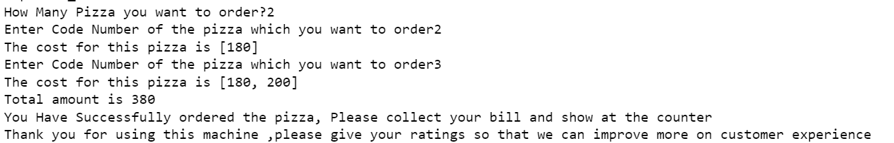

# python-vlab-exp-exceptions
For the experiments created for teaching the concepts of exception handling
## Aim
In this experiment,user will learn the concepts of exception handling

**About the User:**

We are going to study Exception Handling in Python from Tanmay's real world scenario.Tanmay is a fashion designer by profession and he loves designing products using human centred approach

` `Let us begin by reading Tanmay journey as  described below:
## Scenario 1

||
| :- |
|
**User Scenario**

|

|It was a long holiday weekend and hence Tanmay was partying the whole sunday night and came back home at 2 AM in the midnight, he forgets to set up his alarm and wakes up late in the in the morning at 10:00 AM, usually he wakes up at 8:30 AM , now since he is running 1 hour 30 Min late , Hence he decided to pick something outside for his breakfast|
| :- |

||
| :- |
|
**How is the user thinking or feeling?**

Sad, Irritated, guilty (Because of partying late on sunday) 
|
|
**Activity thought of/Performed?**

Decided to skip cooking breakfast at home and instead grab something from outside to eat
|
|
**What are the user expectations?**

Having breakfast from outside will save his cooking time, as a result he would be able to utilise that time in travelling to his office 
|

## Scenario 2
||
| :- |
|
**User Scenario**

|

|As Tanmay is an Italian food lover, he decides to have pizza for his breakfast because he thought that pizza would take less preparation time and he can have pizza while travelling to the office in his car.So, He visits nearby store to eat pizza |
| :- |

||
| :- |
|
**How is the user thinking or feeling?**

Tanmay is opting for a greedy approach, i.e whatever is easily available to eat at the present moment,he chooses that.
|
|
**Activity thought of/Performed**

Tanmay thought of purchasing food which can be carried easily and can be eaten while travelling , hence he purchased pizza since he loves italian food and pizza is easy to carry and can be eaten while performing some other activity too (eg: Travelling)
|
|
**What is the User Expectation?**

Save Time 
|

## Scenario 3
||
| :- |
|
**User Scenario:**

|

|Tanmay has heard a lot of craze about “pineapple on pizza”, so he decided to order pineapple pizza.|
| :- |

||
| :- |
|
**How is the user thinking or feeling?**

Excited, Since he is trying something new
|
|
**Activity Thought of/Performed**

Thought of trying pineapple pizza and follow the crowd
|
|
**What is the user Expectation?**

He would be able to try something new 
|

## Scenario 4
||
| :- |
|
**User Scenario:**

|

|At the ordering counter, When Tanmay asks for pineapple pizza, the waiter politely denies that there is no such thing termed as “pineapple pizza” exists in their store, and in fact the waitress also says that no one except tanmay has enquired for pineapple pizza and hence she said that “pineapple pizza is an **exception**!” |
| :- |

||
| :- |
|
**How is the user thinking or feeling?**

Sad, since he was in the mood of having pineapple pizza , but that pizza was not available in the store
|
|
**Activity thought of/Performed?**

Ask/Order for pineapple pizza in the store
|
|
**What is the user's expectation?**

Order pineapple pizza and consume
|

## Scenario 5
||
| :- |
|
**User Scenario**:

|

|Since pineapple pizza was not available at the store,Tanmay was sad, but he suddenly started thinking about the waitress word i.e Exception . He started thinking about what is an exception? And then decides to study more about exception|
| :- |

||
| :- |
|
**How is the user thinking or feeling?**

The user is **curious** to know about what is exception
|
|
**Activity thought of/Performed?**

To study more about Exceptions
|
|
**What are the user expectations?**

To find out the answer to the question why pineapple pizza is an exception?
|

## What are exceptions in python?

Now as Tanmay is more curious to learn about what is an exception? Let's learn about exceptions in python.There is one famous quote by Benjamin Franklin that “If you fail to plan, you are planning to fail”. The same is applicable for computer engineers because Every intruder finds a way to break into your code. Using Exceptions we can manage these problems in a responsible way.

For eg

- If someone asks you to divide a number by zero, you can throw an exception and letting them know that they cannot divide a number by zero
- In the above example, Tanmay asks for a pineapple pizza and hence the employee at the pizza store declined his bizarre suggestion

All the scenarios explained above are examples of Exception. An Exception is a object with description of what went wrong , followed by a traceback of what went wrong

If we look at the code displayed above, we have initialized a variable named as “marks” with the value 100, then we are trying to divide the number 100 by 0, hence the python raised an ZeroDivisionError Exception stating that you cannot divide a number by zero.

## So what is the difference between an Error and an Exception?

- The major difference between Errors and Exceptions are Error are the ones which cannot be handled by the programmer, whereas Exceptions are the ones which can be handled by the programmer

The following are the most common types of Errors:

1) Syntax Error

- The above image displays an example of Syntax Error
- In the above image, we have a piece of code and in that piece of code after “if and else statement” we have a colon missing, those errors are called as syntactical errors or we can call them compile time errors. 
- We would be getting these type of error during compile time
- A syntax error means that you did not follow the rules and standard which are set by python while writing code.
1) Logical Errors
- This Error is caused due to incorrect business logic applied by the programmer
- In this Error, our code will work fine , because there are no syntax errors.
- Our code will also get compiled successfully,and it will give the output, but the output obtained will be incorrect

(c) Run Time Errors

- These Error occurs due to incorrect input obtained from the user
- The moment you get run time error, your execution stops

The following are the most common types of Exception:

1) ZeroDivisionError 
1) NameError 
1) TypeError
1) ValueError
1) IndexError
1) KeyError
1) ModuleNotFoundError
1) ImportError

This article will explain about ValueError, KeyError, IndexError Exception in python with respect to real world problems faced by Tanmay in the self ordering machine at the pizza shop. The ZeroDivisionError is explained above

## How to Catch Exceptions?

- Exceptions can be caught and handled using Try and except statements in python.
- Statements which you feel can raise exceptions can be kept inside try block,and statements that can handle exception can be kept inside except block

Example: Let us try to access elements from a vegetables list , whose index is out of bounds and handle that corresponding exceptions

From the above example, we can observe that statements that are bound to catch error are placed inside “try” statement.We can observe that the second print statement tries to access vegetable name which are present at 5th index position, but the vegetables list does not contain  anything after index 3, hence when we are trying to access element at 5th index position , it will throw an exception. This exception is caught by the “except” statement

## Catching Specific Exception

- A try statement can consist of more than 1 except clause to handle multiple exceptions in the same program.
- The general syntax for adding specific exceptions are as follows:

|try: `	`statement(s) except IndexError: `                               `statement(s)  except KeyError: `                             `statement(s)|
| :- |

The above figure displays a try statement with multiple except clauses. First the index error would be raised and after that when you comment 2nd print statement from the try block, then KeyError Exception would be raised

In the above figure, we have commented the 2nd print statement from the try clause, hence KeyError exception got executed

## Scenario 6
||
| :- |
|**User Scenario:**|

|Now since Tanmay has learnt about Exception,he understood the basic terminologies of Exception. Now, since he was very hungry he decided to head to the “pizza hut” store, since that store is very close to his office, so he thinks that he can grab a pizza from there and eat it at his office while working(during short-breaks).When he went to the pizza hut store he observed that there was a long queue at the ordering counter |
| :- |

||
| :- |
|
**How is the user thinking/feeling?**

Irritated, because of the long queue
|
|
**Activity thought of/Performed?**

Stand in the long queue 
|
|
**What are the user expectations?**

Find an alternative way to order pizza instead of ordering it at the counter
|

## Scenario 7
||
| :- |
|
**User Scenario:**

|

|
In order to avoid the long queue, tanmay decided to utilize the self ordering machines which is placed by the pizza hut on their Entrance.However after utilizing that product he was no longer fan of that product.While he was ordering pizza in the self ordering machine ,initially he gets the following message as displayed in the below given image:

**Fig 1.1 The machine displays different categories of pizza available at their store. It asks the user to Press-1 if they wish to order pizza from the available categories, otherwise it says press-0 to exit**

**Fig 1.2 Since Tanmay wanted to order pizza from the categories which was displayed to him and as per the machine instructions he pressed -1** ,after which the machine asked tanmay to input which category of pizza he wanted to order?

Fig 1.3 Since tanmay wanted to order “veg” pizza , he typed “veg” on the screen after which the machine displayed that “the category of pizza which was entered by tanmay was available” along with that it also displayed  list of veg pizza available at their store along with their cost and code number. Every pizza is assigned a unique code number and price. For eg: veg cheese burst pizza is assigned code “0” and its price is 100 Rs.

Fig 1.4: After that the machine displayed a message to check the availability of the pizza, hence the machine asked tanmay to input the name of the pizza which he wished to order, hence he entered “vegan” to which the machine displayed an error such as “KeyError”  and tanmay was not able to understand the meaning of the same hence he decided to call the employee and take help from them

|
| :- |

||
| :- |
|

**The above image displays error which tanmay encountered** 
|
|
**How is the user feeling?**

Irritated, because he was not able to understand the error messages
|
|
**Activity thought of/Performed?**

Entered number of pizza which he wishes to have
|
|
**What are the user expectations?**

To display error messages in human-friendly manner 
|

## Scenario 8
||
| :- |
|
**User Scenario:**

|

|
As Tanmay was running short of time, he decided to take help from the store staff member to understand what was the issue with the machine.The staff arrived and she had a look at the display screen of the ordering machine and she informed tanmay about his mistake. His mistake was instead of entering the name of the pizza which was displayed in the menu he entered something which was not available in the menu(i.e vegan pizza) which was displayed to him.At that point Tanmay felt that , The machine should have displayed exactly what mistake he made in a human-friendly manner which could have saved his lot of time

|
| :- |

||
| :- |
|
**How is the user feeling?**

Sad
|
|
**Activity thought of/Performed?**

Took help from the store staff
|
|
**What are the user expectations?**

If the error messages would have been displayed in human friendly way it would have saved his time 

Displays the exact error message which Tanmay was Expecting
|

## What is  keyError Exception?
A python KeyError exception is raised , when you are trying to access a key that is not present in the dictionary.In the above scenario when the machine asked tanmay to enter the name of the pizza which he wanted to order? To this Tanmay entered "Vegan" pizza. Now in the dictionary there is no "vegan" pizza present, hence it raised an KeyError exception.

## Scenario 9
||
| :- |
|
**User Scenario:**

|

|
After Performing the above steps now,the machine asked Tanmay to enter how many pizzas he wished to order? To that Tanmay entered “two” instead of 2. Because of that something displayed on the screen termed as “ValueError” and some error messages were displayed which made tanmay more irritated because he was not able to understand what exactly those error messages meant?Hence he had to call the employee for help

|
| :- |

||
| :- |
|

|
|

The above images displays error message which Tanmay had encountered
|
|
**How is the user feeling?**

Sad
|
|
**Activity thought of/Performed**

Took help from the employee 
|
|
**What are the user expectations?**

Displaying messages in human friendly manner
|

## Scenario 10
||
| :- |
|
**User Scenario:**

|

|He again decided to take help from the store staff member to understand what was the issue with the machine.The staff arrived and she had a look at the display screen of the ordering machine and she informed tanmay about his mistake. His mistake was instead of entering 2 in numerical format he entered 2 in string format which caused a ValueError. At that point Tanmay felt that , The machine should have displayed exactly what mistake he made in a human-friendly manner which could have saved his lot of time|
| :- |

||
| :- |
|
**How is the user feeling?**

Sad
|
|
**Activity thought of/Performed?**

Took help from the store staff
|
|
**What are the user expectations?**

If the error messages would have been displayed in human friendly way it would have saved his time 

Displays the exact error message which Tanmay was Expecting
|

## What is ValueError Exception?
ValueError in python occurs when users gives an invalid value to a function but its argument is valid. For eg: when we ask python to compute square root of a negative integer, although the negative integer is a number argument , the value is invalid. In the above example the machine has asked tanmay to enter how many pizza he wishes to order? To this tanmay entered 2 in string format i.e "two" instead of entering it in numberical format. Hence the user tanmay had given an invalid value as an input, hence the value error occured. The machine expected tanmay to enter a numerical value, but instead he entered a string value. 

## Scenario 11
||
| :- |
|**User Scenario:**|

|

Once the ValueError issue was solved, Tanmay once again started the process of ordering the pizza in the self ordering machine and he repeated all the steps explained above.Now when the machine asked to input code number of the pizza which he wished to order, Tanmay mistakenly entered the wrong code number without even realising it . Now in the screen he was able to see something such as “IndexError” and Tanmay was not able to understand the error message and hence once again he had to call the employee to take help
|
| :- |

||
| :- |
|
**How is the user feeling?**

Irritated
|
|
**Activity thought of/Performed?**

Took help of the employee from the store 
|
|
**What are the user expectations?**

If the error messages would have been displayed in human friendly way it would have saved his time 

|

## What is IndexError Exception

IndexError Exception in python occurs when you are trying to access an index that dosent exists. In the above example each pizza is present at a certain index in a list, that index number acts as a code number for that particular pizza. In the above scenario tanmay entered an index number which is not at all present in the list and hence he got an IndexError Exception

## Scenario 12
||
| :- |
|**User Scenario:**|

|

After solving all the above errors by taking help from the employee, tanmay was finally able to order his pizza, pay the final bill displayed on the screen using his credit/debit card and finally a thank you message was displayed on the screen
|
| :- |

||
| :- |
|
**How is the user feeling:**

Happy, because finally after a lot of trouble he managed to order pizza successfully
|
|
**Activity thought of/performed**

Show bill at the counter and collect pizza
|
|
**What are the user expectations?**

If the machine would have displayed user friendly error messages, it would have saved his lot of time 

The above figure displays the final message which Tanmay received after completion of his order
|

**What is  finally block**
The finally keyword is used with try except block. The finally block will always get executed irrespective if the try block raises an error or not

||
In the above figure it is shown that when tanmay finished ordering pizza, a message is displayed such as "Thank you for using this machine ,please give your ratings so that we can improve more on customer experience", this particular message will always be shown to the user at the end, irrespective of whether he utilizes self ordering machine for ordering pizza or not, because that message is put up under finally block

## References for image scenarios
[1]https://www.dreamstime.com/cartoon-boy-waking-up-late-too-late-to-school-very-shock-seeing-alarm-clock-time-show-o-clock-kid-wake-too-late-to-image167172969

[2]https://www.alamy.com/man-thinking-about-a-slice-of-pizza-a-cartoon-illustration-of-a-man-thinking-about-a-slice-of-pizza-image425761924.html

[3]https://www.shutterstock.com/image-vector/pineapple-pizza-cartoon-illustration-tee-shirt-1480501454

[4]https://www.dreamstime.com/man-ordering-buying-fast-food-drinks-food-court-shopping-mall-vector-illustration-man-ordering-buying-fast-food-image157242302

[5]https://www.pngwing.com/en/search?q=thinking+Man

[6]https://depositphotos.com/vector-images/restaurant-queue-cartoon.html

[7]https://www.kioskmarketplace.com/companies/showcases/meridian/products/food-ordering-kiosks/

[8]https://www.touchbistro.com/blog/why-self-ordering-kiosks-are-becoming-the-secret-weapon-for-successful-restaurants/

[9]https://www.dreamstime.com/angry-businessman-guy-character-isolated-icons-cartoon-design-vector-illustration-image118223326

[10]https://www.touchbistro.com/blog/why-self-ordering-kiosks-are-becoming-the-secret-weapon-for-successful-restaurants/

[11]https://friendlystock.com/product/angry-man-yelling/

[12]https://www.istockphoto.com/search/2/image?mediatype=illustration&phrase=happy+man
